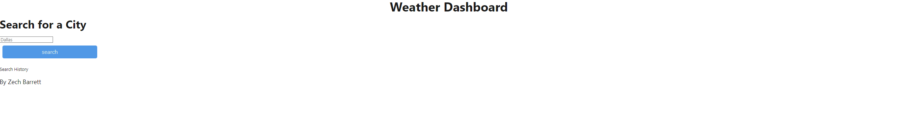
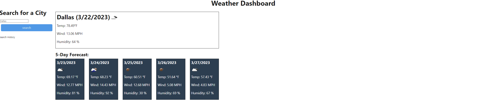

# Weather Dashboard

## Description
A weather dashboard to track weather by searching a city name and displaying a 5 day forecast keeping the using a weather api. 

## Table of Contents
* [Installation](#installation)
* [Usage](#usage) 
* [License](#license)
* [Tests](#tests)
* [Questions](#questions)

## Installation
NA

## Usage 
A user can search for a city and see a current and 5 day forecast

## License
This project is licensed under the MIT license.

## Tests
To run tests, run the following command:
NA

## Questions
Contact through email or Github

Email: zechariahbarrett@outlook.com

GitHub: [zechb7](https://github.com/zechb7) 